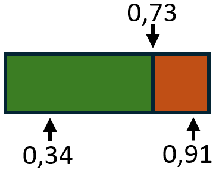
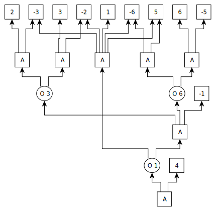

# Random-Configuration-Builder

The Random Configuration Builder can be used to generate synthetic sales using a CNF and installation rates.

# Example result
More information about the input data can be found in the section below [Example input](#example-input).
> c Used Seed: 5021021263621961602  
> c Execution time: 0 seconds  
> c Number of variables: 6  
> c Generated models: 5  
> c Used CNF file: input_data/cnf/Phone_example.cnf  
> c Used Installation rates file: input_data/installation_rates/freq_result_Phone_example_100Decimal.txt  
> c Used procedure: allRandom  
> c Average deviation: 0.11666666666666668  
> 001101  
> 100110  
> 001101  
> 010101  
> 001101  

First three sales as tabular:

| Sales   | 64 Gb Storage | 128 Storage | 256 GB Storage | Black color | 8 GB RAM | 16 GB RAM |
|---------|---------------|-------------|----------------|-------------|----------|-----------|
| Phone 1 | 0             | 0           | 1              | 1           | 0        | 1         |
| Phone 2 | 1             | 0           | 0              | 1           | 1        | 0         |
| Phone 3 | 0             | 0           | 1              | 1           | 0        | 1         |
| ...     | ...           | ...         | ...            | ...         | ...      | ...       |

Some more complex data can be found in the input_data and output_data folders.

# Example Input

As input, you have to provide a CNF and associated Installation Rates.  
More information and input files can ben found in [CNF-Generator](https://github.com/SteffenHub/CNF-Generator) and [Installation-Rate-Builder](https://github.com/SteffenHub/Installation-Rate-Builder)

Installation rates refer to the frequency or percentage with which specific configurable options of a product are selected by users.  
These rates provide insight into user preferences and can help in optimizing product offerings, inventory management, and marketing strategies.

For instance, consider a configurable product like a smartphone that comes with various options such as different storage capacities,  
colors, and RAM capacities. Installation rates would describe how often each of these options is chosen by users. For example:
- 1: 64 GB storage: 40%
- 2: 128 GB storage: 35%
- 3: 256 GB storage: 25%
- 4: Black color: 100%
- 5: 8GB RAM: 60%
- 6: 16GB RAM: 40%

These percentages indicate the popularity of each configuration option among users.

Behind these installation rates, there is a Conjunctive Normal Form (CNF) representation.
The individual choice options, such as storage capacities, form a family, which are in an XOR relationship.
For example a Family of 1, 2 and 3 means you can choose exactly one of them.

In the conjunctive normal form, this is written as:
> ((1 ∨ 2 ∨ 3) ∧ (!1 ∨ !2) ∧ (!1 ∨ !3) ∧ (!2 ∨ !3))

For the Phone example the CNF can look like (src/input_data/cnf/Phone_example.cnf):
> p cnf 6 8  
> c Family for storage  
> 1 2 3 0  
> -1 -2 0  
> -1 -3 0  
> -2 -3 0  
> c Family for color  
> 4 0  
> c Family for accessories  
> 5 6 0  
> -5 -6 0  
> c 64GB Storage is not available with 16 GB RAM(1 -> !6)  
> -1 -6 0

Syntax hints:  
p cnf number_of_variables number_of_rules  
A line beginning with c introduces a comment

In this simple example the installation rates contain at least the rules:
- The sum of installation rates of a family is 100%
- The installation rate of 5(8GB RAM) is greater or equals 1(64 GB Storage)

Associated installation rates generated with the [Installation-Rate-Builder](https://github.com/SteffenHub/Installation-Rate-Builder) (src/input_data/installation_rates/freq_result_Phone_example_100Decimal.cnf): 

> c used cnf: ../data/Phone_example.cnf  
> c 100% vars: 1  
> c 0% vars: 0  
> c used decimal places: 100  
> c used seed: 8467335337672211825  
> c needed time: 0.7834186553955078 seconds  
> 0.11  
> 0.54  
> 0.35  
> 1.0  
> 0.21  
> 0.79

This means for example 11% of all sales are the 64 Gb storage version or 21% of all sales are the 8 GB RAM version.

With this two input files we can generate synthetic sales. See [Example Result](#example-result)


# Run
To run this Code you need to download the Sat4J SAT-solver and integrate it into your Project.  
Some procedures(randomConflictsWithNNF, NNFTreeDownToUp) need the c2d solver. If you use these procedures you need to integrate this solver too.  
After setting up the solver you have to run the Main file and answer some questions in a Dialog. See [How to use](#how-to-use)


#### [Integrate SAT4J](#download-sat4j-1)
*  In IntelliJ go to File -> Project Structure -> Libraries -> + -> Java and select the org.sat4j-core.jar

#### [Integrate c2d](#download-c2d)
*  Just put the c2d.exe into the main folder(Random-Configuration-Builder)
*  If the name is not 'c2d.exe' e.g. 'c2d_windows.exe'/ 'c2d_linux.exe' you have to rename the file
# Download Sat4J

Releases are available at [OW2 Releases](https://gitlab.ow2.org/sat4j/sat4j/-/releases)

Select [Precompiled binaries](https://release.ow2.org/sat4j/) to download a .jar directly. We used the core-version for this Project.

# Download c2d

Release are available at [reasoning.cs.ucla.edu](http://reasoning.cs.ucla.edu/c2d/)

Under the Download section you will find the download link.

# How to use

With run the main file we get into a Dialog where we have to answer some questions for the input data.

> Which CNF file should be used. Pass the path like: input_data/cnf/Phone_example.cnf  
> > input_data/cnf/Phone_example.cnf  
> 
> [1, 2, 3]  
> [-1, -2]  
> [-1, -3]  
> [-2, -3]  
> [4]  
> [5, 6]  
> [-5, -6]  
> [-1, -6]  
> 
> Which Installation rate file should be used. Pass the path like: input_data/installation_rates/freq_result_Phone_example_100Decimal.txt  
> > input_data/installation_rates/freq_result_Phone_example_100Decimal.txt
> 
> 0.11 - 0.54 - 0.35 - 1.0 - 0.21 - 0.79 -  
> 
> Which procedure you want to use. Type in a number. Choose between:  
> 1. randomConflictsWithNNF  
> 2. allRandom  
> 3. allRandomExclude01Rates  
> 4. checkConsistency
> 5. NNFTreeDownToUp  
> 6. approachInstallationRates  
> > 2
> 
> How many models should be build. Example: 100000  
> > 5
> 
> Which seed should be used for the random generator. Example: 8902374. Type 'None' if a random seed should be generated.  
> > None
> 
> -3952349368590913869 set as seed
 
# How it works

The Code simulates a customer configuring a Product in this case a Phone in each iteration.  
As input we can set the number of different customers configuring the product resp. how much synthetic sales should be generated.  
In the [start dialog](#how-to-use) we can choose between 6 procedure options.  
During these procedures we have to decide either chose a variable or not using the given installation rates.  

### select a variable or not

To decide either choose a variable or not using the installation rates we proceed as follows:   
We pick a variable for example variable 3 and look up there installation rate for example 73%.  
Than we generate a random floating point number.
If this number is smaller than 0,73 we choose this variable else not.  
For example we generate the number 0,34, than this variable will be chosen, if we generate for example the number 0,91 this variable will not be chosen.  


After that we have to prove, that our decision is valid using the cnf resp. the Sat-Solver.  
For example we pick the variable 3 (256GB storage) with an installation rate of 35% and generate a random floating point number: 0.24, so we chose this option.  
Because we don't decide anything before this chose is valid with the cnf.  
Next we pick the variable 2 (128GB storage) with an installation rate of 54% and generate a random floating point number: 0.46, so we chose this option.  
When we prove our decision with the Sat-Solver this decision is not valid, because only exactly one storage option can be selected.  
In this case we ignore our decision about variable 2 (128GB storage) and add it as not selected to our solution.


```java
chooseVarOrNot(int var){
   if (installationRates[var - 1] < random.nextDouble()) {
      // do not choose this variable
      var = var * -1;
   }
   if (satSolver.isSatisfiableWith(var)) {
       // check if our decision is valid using the satSolver
       solution.add(var);
   } else {
       // if our decision is not valid negate the variable
       solution.add(var * -1);
   }
}
```


1. #### randomConflictsWithNNF  
   In this procedure each customer have to take decisions about all conflict variables in the [NNF-Tree](#nnf-tree).   
   In the given [NNF-Tree](#nnf-tree) for the phone example each customer takes a decision about the variables:
   * 1 (64GB storage)
   * 3 (256GB storage)
   * 6 (16GB RAM)
   
   After answering all questions either choose or not we've got a valid Phone configuration.
   ```
   leftConflictVariables = allConflictVariables
   while leftConflictVariables is not empty
      randomVariable = radomPick(leftConflictVariables)
      // decide choose this variable or not
      // remove randomVariable from leftConflictVariables 
   ```

2. #### allRandom
   In this procedure each customer takes decisions about all variables in a random order.  
   We've got 6 different variables:
   - 1: 64 GB storage
   - 2: 128 GB storage
   - 3: 256 GB storage
   - 4: Black color
   - 5: 8GB RAM
   - 6: 16GB RAM  
   
   The Program will choose one of this 6 variables randomly.  
   For example 2 (128GB storage):  
   After that we either [choose this variable or not using the installation rates](#select-a-variable-or-not).  
   Next the Program choose one of the left variables for example 3 (256GB storage).  
   And we again decide either choose this variable or not.  
   This continues until a decision has been made for each variable.
   ```
   leftVariables = allVariables
   while leftVariables is not empty
      randomVariable = radomPick(leftVariables)
      // decide choose this variable or not
      // remove randomVariable from leftVariables 
   ```

3. #### allRandomExclude01Rates
   This procedure works just like allRandom except that all variables with a fixed truth value will be excluded at the beginning for performance improvements.  
   In the Phone example there is the variable 4 (Black color). This is the only color that is selectable, so we don't have to consider this in our procedure.  
   It is also possible that a variable is never selectable this variables will be excluded too.

   ```
   // remove all variables with fixed truth value from allVariables
   leftVariables = allVariables
   while leftVariables is not empty
      randomVariable = radomPick(leftVariables)
      // decide choose this variable or not
      // remove randomVariable from leftVariables 
   ```
   
4. #### checkConsistency

5. #### NNFTreeDownToUp
   In this procedure each customer is going through the [NNF-Tree](#nnf-tree).
   With reaching all last leaf nodes a valid configuration is made.
   ``` 
   // Move through the whole NNF-Tree starting at the bottom.
   if node is AND
      // go through all outgoing nodes.
   else if node is OR
      // make a decision for the conflict variable and go this path.
   else 
      // save the variable in this node
   ```

6. #### approachInstallationRates


# NNF Tree
  
This tree shows the NNF decision tree for the Phone example generated with [c2d-solver](#download-c2d).  
This tree can be generated with the c2d-solver using this command:
> c2d -in Phone_example.cnf -visualize

After run this command you get a VCG-file which can be visualized with [yComp](https://pp.ipd.kit.edu/firm/yComp.html).

This tree can be read from down to up.  
An A-node means a logical AND, so all outgoing edges must be considered.
An O-node means a logical OR and called conflict, the conflicted variable stand after the O. At this point you have to take a 
decision about the conflict variable(choose or no choose).  
Going through the whole tree will give us a valid Phone configuration.

For more information visit the c2d site or download the manual which can be found on in the download section on the c2d site.

